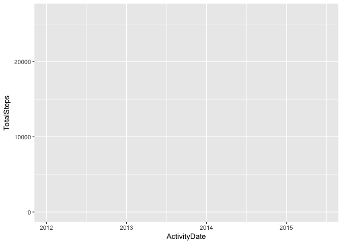
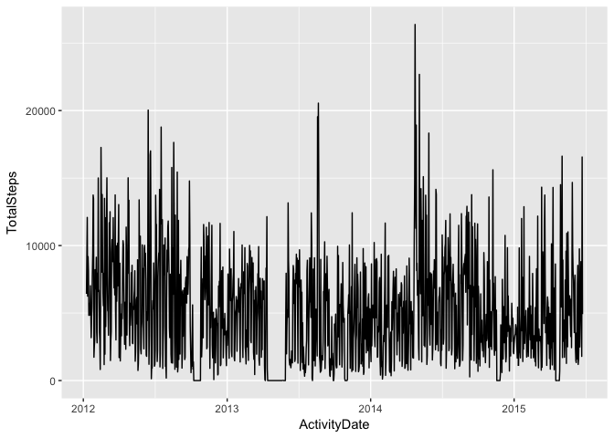

r4bs: Visualizing Data
================

First things first - let's make sure you have all the necessary files.

1.  Navigate to the [r4bs github repo](https://github.com/erramirez/r4bs)
2.  Download or Clone the repo
3.  Open the r4bs.Rproj file

ggplot
------

One of the most powerful aspects of the R language is the plotting capabilities. `ggplot2` is the most widely used plotting and visualization package, with many powerful options and additional related packages that fit most visualization needs.

`ggplot2` has a very definitive way of "building" visualizations that we'll explore here with the example data we explored in previous sections. We'll also briefly work on how to format and clean up plots for sharing in reports and publications.

### The pieces of a ggplot

You need three pieces of information in order to build a basic plot using the `ggplot()` function: 1. a data set 2. an aesthetic mapping of the data from (1) 3. a geometrical object that represents the mappings from (2)

While this sounds odd, it's really just the terminology that might be confusing. Let's explore by making a few different plots.

Bar, Lines, and Points
----------------------

We can create our base plot that includes information about the *data set* and the *aesthetic mappings* we want to use.

Let's start with understanding the total number of steps per day across our `p01_dailyActivity` data set. We start by passing the data set, `p01_dailyActivity`, and then the x and y aesthetic mappings. We want the data along our x-axis so we first pass `ActivityDate` and we then pass `TotalSteps` to the y-axis.

``` r
library(tidyverse)
```

    ## ── Attaching packages ────────────────────────────────────────────────────────────────────── tidyverse 1.2.1 ──

    ## ✔ ggplot2 2.2.1     ✔ purrr   0.2.4
    ## ✔ tibble  1.4.2     ✔ dplyr   0.7.4
    ## ✔ tidyr   0.8.0     ✔ stringr 1.3.0
    ## ✔ readr   1.1.1     ✔ forcats 0.3.0

    ## ── Conflicts ───────────────────────────────────────────────────────────────────────── tidyverse_conflicts() ──
    ## ✖ dplyr::filter() masks stats::filter()
    ## ✖ dplyr::lag()    masks stats::lag()

``` r
#read in data
p01_dailyActivity <- read_csv("~/GitHub/r4bs/ExampleData/FitbitDailyData/p01_dailyActivity.csv",
                            col_types = cols(
                              ActivityDate = col_date("%m/%d/%y") 
                            )
)

# create the base plot here with no geometric mapping
p01_baseplot <- ggplot(p01_dailyActivity, aes(ActivityDate, TotalSteps))

# we can also pass the data, x, and y, arguments for easy of understanding our code
p01_baseplot2 <- ggplot(data = p01_dailyActivity, aes(x = ActivityDate, y = TotalSteps))

# view the base plot with no geometry

p01_baseplot
```



We can now add a geom to visually represent our data within the plot. Let's start with a simple scatter plot. We have two options here: 1. Build off the previous `baseplot` 2. Create a new ggplot object

### Points

``` r
# building off baseplot
p01_scatterplot1 <- p01_baseplot + geom_point()

p01_scatterplot1
```


``` r
# build a new plot object
p01_scatterplot2 <- ggplot(p01_dailyActivity, aes(ActivityDate, TotalSteps)) +
  geom_point()
  
p01_scatterplot2
```


You can also use bars and lines to represent data.

### Lines

While not relevant to this data set, there are two geometries for creating lines: `geom_lines()` and `geom_path()`: \* `geom_lines()`: connects the observations in order of the x variable \* `geom_path()`: connects the observations in the order it appears in the data set

``` r
# use the geom_line
p01_lineplot1 <- p01_baseplot + geom_line()

p01_lineplot1
```



### Bars

You would think that `geom_bar()` would be the obvious choice here, but in reality we want to use `geom_col()` as we're representing the value of the data, and not a proportion.

``` r
p01_barplot1 <- p01_baseplot + geom_bar()

p01_barplot1
```

    ## Error: stat_count() must not be used with a y aesthetic.

``` r
p01_colplot <- p01_baseplot + geom_col()

p01_colplot
```


Facets, Fills, and Colors
-------------------------

Of course, you're not always going to visualize a single participant's data. You may want to visualize multiple participants all at once and make sense of differences. We can use ggplot2 functionality to do that. First let's create a new data set that only includes data for 2015, since that's the year with the most overlap.

``` r
### reading in data ####
dailyactivity_all <- list.files(path = "~/GitHub/r4bs/ExampleData/FitbitDailyData/",
                    pattern = "*.csv", # only look for .csv files
                    full.names = TRUE) %>% # use the full path name
  map_df(~read_csv(., 
                   col_types = cols( 
                     ActivityDate = col_date("%m/%d/%y")
                     )
  )
  )

demographics_factor <- read_csv("~/GitHub/r4bs/ExampleData/FitbitDemographics/demographics.csv", 
                                col_types = cols(
                                  Gender = col_factor(levels = c("Female", "Male")),
                                  Ethnicity = col_factor(NULL),
                                  Education = col_factor(levels = 
                                                           c("Some High School",
                                                             "Some College or Vocational Training",
                                                             "Completed College or University",
                                                             "Completed Graduate or Professional Degree")),
                                  `Martial Status` = col_factor(levels = NULL), 
                                  `Work Status` = col_factor(levels = NULL),
                                  Income = col_factor(levels = c("$10,000-$19,000",
                                                                 "$20,000-$29,000",
                                                                 "$30,000-$39,000",
                                                                 "$40,000-$49,000",
                                                                 "$50,000-$59,000",
                                                                 "$60,000-$69,000",
                                                                 "$70,000-$79,000",
                                                                 "$80,000-$89,000",
                                                                 "$90,000-$99,000",
                                                                 "> $100,000"), 
                                                      ordered = TRUE
                                                      )
                                )
)

library(readxl)
stepgoals <- read_xlsx("~/GitHub/r4bs/ExampleData/FitbitDemographics/goals.xlsx")

# using inner_join for only matching ids in both data sets
# id is saved as ID in demographics, tell inner_join about that id == ID
# chaining joins to add a third data set, stepgoals
dailyactivity_demo_goals <- inner_join(dailyactivity_all, demographics_factor, by = c("id" = "ID")) %>% 
  left_join(., stepgoals)
```

    ## Joining, by = "id"

``` r
# we can use the filter() function to filter applicable rows
dailyactivity_2015only <- dailyactivity_demo_goals %>% 
  filter(ActivityDate >= "2015-01-01") 
```

    ## Warning: package 'bindrcpp' was built under R version 3.4.4

``` r
# we can create a summary data set too
dailyactivity_2015only_summary <- dailyactivity_2015only %>% 
  group_by(id) %>% 
  summarise(days = n(),
            meansteps = mean(TotalSteps),
            sdsteps = sd(TotalSteps),
            minsteps = min(TotalSteps),
            maxsteps = max(TotalSteps),
            meanMVPA = mean(FairlyActiveMinutes+VeryActiveMinutes),
            sdMVPA = sd(FairlyActiveMinutes+VeryActiveMinutes),
            minMVPA = min(FairlyActiveMinutes+VeryActiveMinutes),
            maxMVPA = max(FairlyActiveMinutes+VeryActiveMinutes)
  )
```

We want to see how everyone did \#\# Formatting Plots
